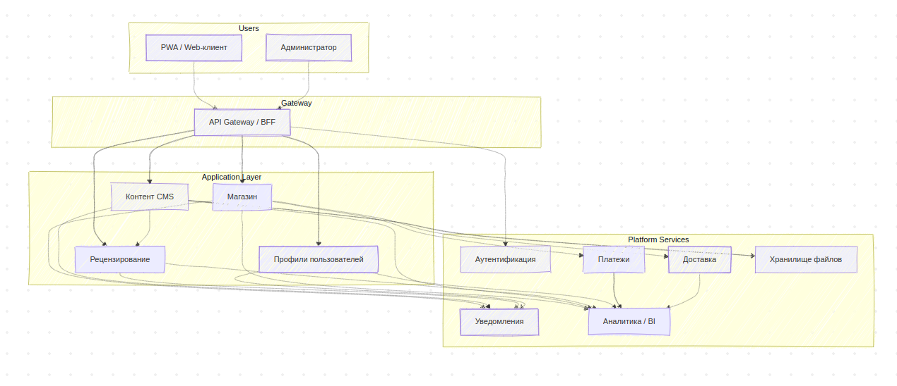

# HW_2: Интеграции и HLD

## 1. Сервисы системы

| Сервис                           | Назначение |
|----------------------------------|------------|
| **Auth-сервис**                  | Аутентификация, авторизация, управление токенами |
| **CMS (Content Management System)** | Работа с главами книг, загрузка, публикация, версиями |
| **Review-сервис**                | Управление процессом рецензирования, хранение замечаний |
| **Store-сервис**                 | Онлайн-магазин книг, каталог, заказы, бета-доступ |
| **Payment-сервис**               | Проведение транзакций, интеграция с ОФД, генерация чеков |
| **Notification-сервис**         | Email, push, WebSocket-уведомления |
| **Delivery-сервис**             | Интеграция с логистикой: трекинг, печать, доставка |
| **Analytics-сервис**            | BI-дашборды, события пользователей, отчеты |
| **Admin-сервис**                | Модерация, управление пользователями и процессами |
| **File Storage**                | Хранение глав, PDF, DOCX |
| **User Profile сервис**         | Роялти, история активности, предпочтения пользователя |

---

## 2. Интеграции между сервисами

Ниже представлена таблица интеграций с подробным обоснованием выбора:

| От (Источник)    | Кому (Цель)       | Тип      | Технология       | Обоснование                                                                  |
|------------------|-------------------|----------|------------------|------------------------------------------------------------------------------|
| Клиент (PWA)     | API Gateway       | Sync     | HTTPS / REST     | Отрисовка UI требует мгновенного ответа.                                     |
| API Gateway      | Auth              | Sync     | REST (JWT/OAuth) | Аутентификация должна быть мгновенной, для доступа к остальным сервисам.     |
| API Gateway      | CMS               | Sync     | REST             | Работа с главами (отображение, загрузка) требует быстрых ответов.            |
| API Gateway      | Store             | Sync     | REST             | Покупка, просмотр каталога — важны отклики в реальном времени.               |
| API Gateway      | Profile           | Sync     | REST             | Персонализация и доступ к профилю происходят во время работы клиента.        |
| API Gateway      | Notification      | Async    | WebSocket / Push | Для real-time уведомлений (новые главы, оповещения) — постоянное соединение. |
| CMS              | File Storage      | Sync     | REST / S3        | Загрузка и чтение глав должны происходить быстро и предсказуемо.             |
| CMS              | Review            | Async    | Kafka / MQ       | Рецензирование может происходить в фоне, независимо от загрузки главы.       |
| CMS              | Notify            | Async    | Kafka / Email    | Не нужно мгновенно уведомлять — можно отложить через очередь.                |
| CMS              | Analytics         | Async    | Kafka / ETL      | Запись событий (публикация, обновление главы) для последующей аналитики.     |
| Review           | CMS               | Async    | Kafka            | Передача результатов рецензирования (отложенная публикация/ответ).           |
| Review           | Notify            | Async    | Kafka / Email    | Оповещение автора о завершении рецензии — не критично к скорости.            |
| Store            | Payment           | Sync     | REST / PCI API   | Платёж требует завершения в реальном времени, с подтверждением клиенту.      |
| Store            | Delivery          | Async    | MQ / API         | Обработка доставки может выполняться фоново (интеграция с логистикой).       |
| Store            | Notify            | Async    | Kafka            | Уведомление о покупке, статусе заказа и обновлениях.                         |
| Store            | Analytics         | Async    | Kafka / ETL      | События заказов, покупок, бета-доступа передаются для анализа.               |
| Store            | Profile           | Sync     | REST             | Необходимость получения истории покупок, рекомендательной логики.            |
| Admin            | CMS               | Sync     | REST             | Управление публикациями требует прямого доступа и быстрой обратной связи.    |
| Admin            | Review            | Sync     | REST             | Арбитраж требует видеть правки, участвовать в процессе.                      |
| Admin            | Store             | Sync     | REST             | Контроль каталога, цен и акций — в админке нужен немедленный отклик.         |
| Admin            | Profile           | Sync     | REST             | Управление доступами, ролями, настройками пользователей.                     |
| Profile          | Notify            | Async    | Kafka / Email    | Настройка подписок на уведомления — не требует синхронности.                 |
| Payment          | Analytics         | Async    | Kafka            | Все транзакции логируются для отчетности и анализа (финансовый контроль).    |
| Profile          | Analytics         | Async    | Kafka            | Поведение пользователя важно для BI и персонализации.                        |

---

## 3. Обоснование способов взаимодействия

### **Синхронное взаимодействие (REST)**

**Когда применяем:**
- Необходим немедленный ответ клиенту или пользователю.
- Операция критична для UX (например, покупка или логин).
- Транзакционная логика — например, нельзя дважды продать книгу, или нужно сразу отразить состояние платежа.

**Плюсы:**
- Простота интеграции.
- Предсказуемость: клиент "знает", завершилась ли операция.

**Минусы:**
- Уязвимость к сбоям одной из сторон.
- Ограниченная масштабируемость (нагрузка ложится на оба сервиса одновременно).

---

### **Асинхронное взаимодействие (Kafka / Message broker)**

**Когда применяем:**
- Нет необходимости немедленного ответа (например, отправка уведомления).
- Обработка фоновых задач, событий, отчётов.
- Высокая масштабируемость и отказоустойчивость (можно повторить сообщение, поставить в очередь).

**Плюсы:**
- Устойчивость к отказам.
- Независимость компонентов.
- Высокая производительность.

**Минусы:**
- Повышенная сложность: нужна идемпотентность, логирование, ретраи.
- Не всегда очевидна трассировка вызовов.

---

### **WebSocket / Push / SSE**

Используются для real-time уведомлений (например, "Вышла новая глава", "Появился ответ рецензента").

**Почему не REST?**
- REST не позволяет "пушить" клиенту данные.
- WebSocket держит открытое соединение, что удобно для быстрой доставки сообщений.

---

## 4. Верхнеуровневая схема HLD

