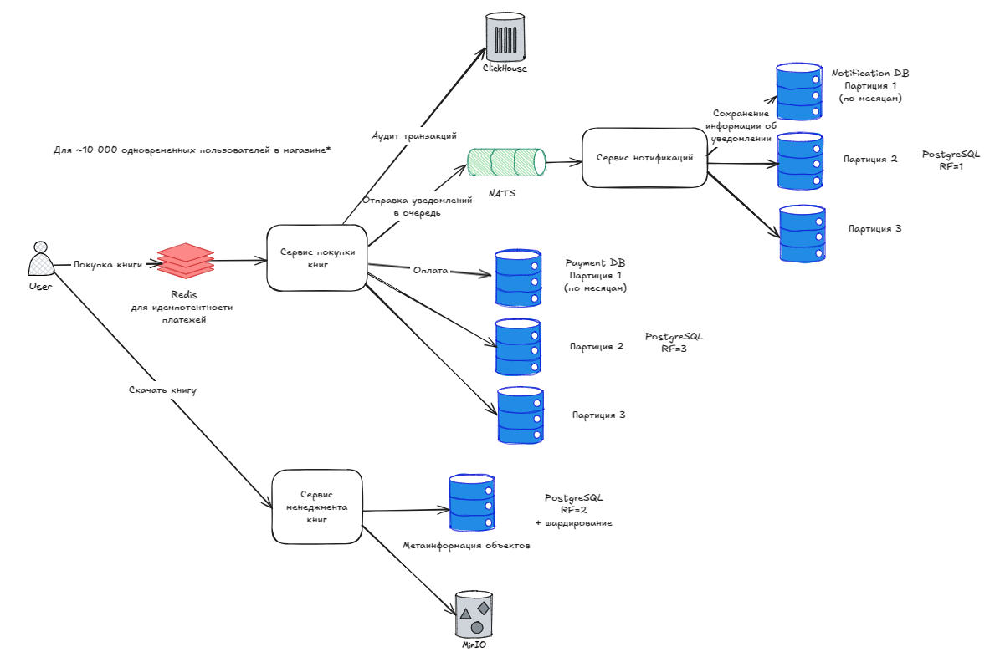

## Домашка 3: Базы данных

## 1. Сценарии и выбор БД

| Сценарий | Сервис | Тип БД | Обоснование |
|----------|--------|--------|-------------|
| Аутентификация и авторизация | Auth-сервис | PostgreSQL | Простые таблицы, уникальные индексы, контроль доступа |
| Управление контентом | CMS | PostgreSQL + MinIO | Структурированные главы, версии — в БД, файлы — в объектном хранилище |
| Рецензирование | Review-сервис | PostgreSQL | Таблицы: глава, замечание, статус, пользователь; нужны транзакции |
| Магазин и каталог | Store-сервис | PostgreSQL | Категории, фильтрация, связи с пользователями и транзакциями |
| Платежи | Payment-сервис | PostgreSQL + Redis | ACID-транзакции, Redis для токенов, идемпотентности |
| Уведомления | Notification-сервис | PostgreSQL + NATS | Лог отправок в БД, сообщения через NATS |
| Доставка | Delivery-сервис | PostgreSQL | Гибкие, но типизированные статусы доставки, трекинг |
| Аналитика | Analytics-сервис | ClickHouse | Высокоскоростная агрегация событий, BI-отчёты |
| Файлы | File Storage | MinIO / S3 | Объектное хранилище: главы, обложки, финальные версии книг |
| Профиль пользователя | User Profile | PostgreSQL | Роялти, предпочтения, история активности — чёткая структура |

---

## 2. Репликация и масштабирование

### Репликация

- **PostgreSQL**: синхронная для платежей, асинхронная — для остального.
- **NATS**: кластеризация для отказоустойчивости.

### Масштабирование:

В НТ говорилось о 10 000 одновременных пользователей в магазине. Для такого объёма пользователей платежи можно партиционировать
по месяцам. Аналогичный объём данных ожидается для таблиц уведомлений, которые требуют такое же разделения по партициям.

Нужность шардинга для таблиц, содержащих метаинформацию о файлах, зависит не столько от количества пользователей, сколько
от количества книг. В данном случае оно скорее понадобится. 

#### Где применимо партиционирование:
- **ClickHouse**: по дате (анализ событий).
- **PostgreSQL**:
    - По дате в таблицах оплат, уведомлений.
    - По жанру книг.

---

## 3. Критерии выбора PostgreSQL

| Вопрос | Ответ                                                        |
|--------|--------------------------------------------------------------|
| Что за данные? | Таблицы: пользователи, книги, главы, транзакции, уведомления |
| Формат данных? | Реляционный, поддержка JSONB для гибких полей                |
| ERD? | Да — строгие связи между сущностями (глава → книга → автор)  |
| Сценарии? | Поиск, фильтрация, транзакции, история, статусы              |
| Типовой проект? | Да, типичный CMS + e-commerce                                |
| Из коробки? | ACID, индексы, foreign keys, партиционирование, роли         |
| Популярность? | Очень высокая (PostgreSQL — один из лидеров)                 |
| Лицензия? | PostgreSQL License (OSS, permissive)                         |
| Сопровождение? | Широкая поддержка, множество инструментов                    |
| Изменения? | Гибкая схема, миграции                                       |

---

## 4. Использование NATS

- Лёгкий брокер сообщений для взаимодействия между микросервисами.
- Простая интеграция с Go, Python, Node.js.
- Используется для:
    - Уведомлений (новая глава, статус заказа)
    - Событий (публикация книги, отклонение рецензии)
- Преимущества над Kafka:
    - Меньше ресурсов
    - Проще разворачивать
    - Подходит под 95% сценариев в системе

---

## 5. Вывод: Архитектура БД

| Тип данных | БД | Обоснование |
|------------|----|-------------|
| Структурированные (книги, главы, рецензии, пользователи) | PostgreSQL | Надежность, гибкость, транзакции |
| События и метрики | ClickHouse | Аналитика, агрегации |
| Файлы | MinIO / S3 | PDF, DOCX, обложки |
| Временные данные / кеш | Redis | Коды, токены, идемпотентность |
| Асинхронные события | NATS | Событийная модель между сервисами |

