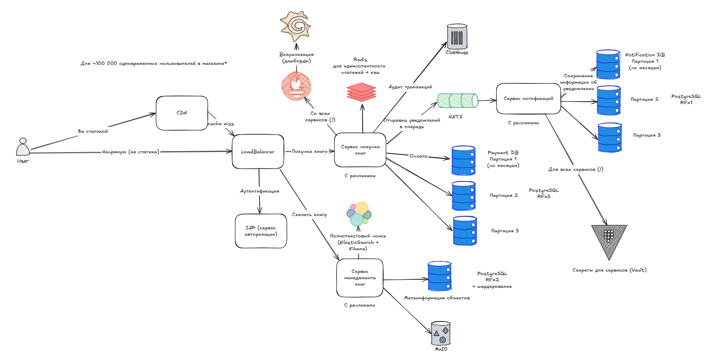

### Задание
Доделать High Level Design, добавив в систему дополнительные компоненты и обосновать их целесообразность.

Ваша задача понять, какие дополнительные компоненты ОБЯЗАТЕЛЬНЫ (MUST) в вашей системе, а какие МОЖНО (SHOULD) добавить в систему.

Если знаете, какие конкретно компоненты выбрать (технологии): пишите в реализацию. Если нет, не страшно.

Добавить их на схему в ваш HLD.

### Выполнение

### **1. Обязательные компоненты (MUST)**

| Компонент                   | Обоснование                                                                                                                          | Реализация                                                                     |
|-----------------------------|--------------------------------------------------------------------------------------------------------------------------------------|--------------------------------------------------------------------------------|
| **Load Balancer**           | Распределение трафика между инстансами микросервисов. Обеспечивает масштабирование и отказоустойчивость                              | Yandex Load Balancer или NGINX + Consul                                        |
| **CDN**                     | Раздача обложек, PDF, статики (JS/CSS) ближе к пользователю. Особенно важно для геораспределённости | Яндекс CDN или VK CDN, S3 + Cloudflare (если можно)                            |
| **Кэш**                     | Ускорение доступа к часто запрашиваемым данным: профили, каталоги, настройки                                                         | Redis Cluster                                                                  |
| **IdP (Identity Provider)** | Централизованная аутентификация и авторизация для авторов, рецензентов, админов                                                      | Keycloak (OAuth2/OpenID Connect)                                               |
| **WAF**                     | Защита от распространённых атак (SQLi, XSS и др.), фильтрация трафика                                                                | Yandex Cloud WAF или NGINX + ModSecurity                                       |
| **CI/CD**                   | Быстрое и безопасное выкатывание фич, особенно важно при большом числе микросервисов                                                 | GitLab CI/CD + Helm + Canary deployments                                       |
| **Observability**           | Логирование (например, отзывов), метрики (оплаты, ошибки), трассировка запросов между сервисами                                      | Grafana + Prometheus + Loki + Tempo + OpenTelemetry                            |
| **Резервное копирование**   | Обязательное требование к сохранности данных (особенно PostgreSQL и MinIO)                                                           | WAL-G для PostgreSQL, MinIO snapshots на S3                                    |
| **API Gateway**             | Централизованный вход в систему, rate limiting, кросс-доменные запросы, защита API                                                   | Tyk или Kong API Gateway                                                       |
| **Audit Logging**           | Необходимость фиксировать ключевые действия: публикации, рецензии, платежи                                                           | Loki + отдельная таблица audit_log (зависит от активности, можно и Clickhouse) |
| **Monitoring Alerting**     | Быстрое реагирование на сбои в платёжках, CMS, Store                                                                                 | Alertmanager + Telegram Webhook                                                |
| **Secrets Management**      | Безопасное хранение API-ключей, токенов, SMTP, паролей к базам данных                                                                | Vault или Yandex Lockbox                                                       |
| **Elasticsearch + Kibana**         | Полнотекстовый поиск по книгам, главам, рецензиям с удобным интерфейсом и аналитикой       | Elasticsearch + Kibana         |

---

### **2. Рекомендуемые компоненты (SHOULD)**

| Компонент                          | Обоснование                                                                                 | Реализация                     |
| ---------------------------------- |---------------------------------------------------------------------------------------------| ------------------------------------------- |
| **Service Mesh**                   | Управление трафиком между микросервисами, ретраи, таймауты, circuit breaking                | Istio или Linkerd                           |
| **GeoDNS**                         | Геораспределение пользователей между ближайшими кластерами                                  | Yandex DNS с Geo-распределением             |
| **ETL-платформа**                  | Перенос данных из ClickHouse / PostgreSQL в отчётные хранилища, отчёты в BI                 | Airbyte, Apache NiFi                        |
| **Event Replay/Dead Letter Queue** | Возможность повторной обработки неудачных событий из NATS, отслеживание проблемных delivery | NATS JetStream               |
| **Rate Limiter**                   | Ограничение активности пользователей (например, спам в рецензиях, фрод при покупках)        | Redis-based Token Bucket / Kong plugin      |
| **Preview Environment**            | Поднятие окружений на каждую ветку/фичу для preview перед мержем в master                   | GitLab Review Apps                          |
| **Content Diff Viewer**            | Поддержка сравнения глав и версий для удобства рецензентов и авторов                        | Diff-match-patch + custom CMS UI            |
| **PDF Generator**                  | Генерация сборок книг (по главам) в PDF при финальной публикации                            | wkhtmltopdf или WeasyPrint                  |

---

