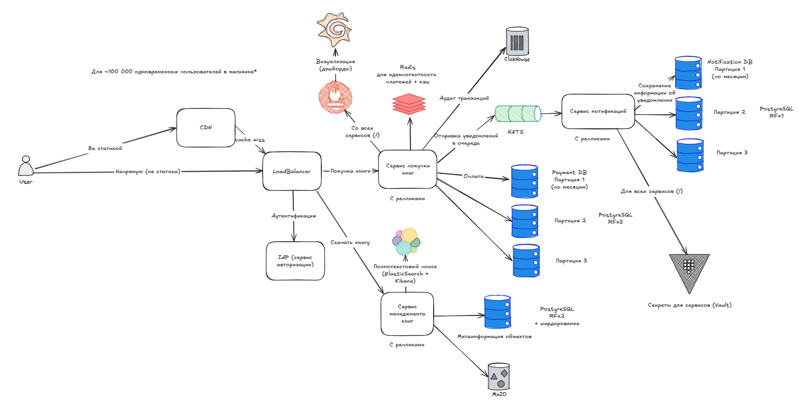

# System Design Document
## Дизайн системы: Agile Dead Trees – Интегрированная платформа издательства

---

## Глоссарий

| Термин        | Определение                                                                 |
|---------------|------------------------------------------------------------------------------|
| System Design | Процесс проектирования систем с учетом всех их компонентов и взаимодействий |
| CMS           | Система управления контентом, в которой авторы публикуют главы книг         |
| Dead Trees    | Термин, обозначающий физическую (печатную) копию книги                      |
| Beta-доступ   | Предварительный доступ к неполной версии книги для покупателей              |
| Рецензент     | Участник, проверяющий главы книг и оставляющий комментарии авторам         |

---

## 1. Цели и предпосылки (Отсев + Scope Refinement)

### 1.1 Контрольные вопросы

- **Какая цель у стейкхолдеров?**  
  Объединить CMS и магазин книг для повышения выручки и эффективности авторского процесса.

- **Какую проблему решает система?**  
  Разрозненность процессов создания, рецензирования и продажи книг приводит к задержкам, ручной работе и потерям прибыли.

- **Какой результат будем считать успехом?**
   - Сокращение времени публикации новых глав на 50%
   - Рост выручки от бета-продаж на 30%
   - Увеличение конверсии клиентов на 20%

- **Как будем измерять результат?**  
  Метрики:
   - Среднее время от загрузки главы до публикации
   - Количество покупок бета-книг
   - Обратная связь от пользователей (оценки)
   - A/B тестирование различных моделей доступа

- **Для кого создается система и какие боли закрываем?**
   - **Авторы:** неэффективный процесс публикации
   - **Рецензенты:** нет централизованного места для работы
   - **Клиенты:** неудобный доступ к обновляемому контенту
   - **Издательство:** дублирование данных, ручной труд

- **Что будет, если мы не сделаем систему?**  
  Потеря конкурентных преимуществ, увеличение операционных издержек, отток авторов.

- **Что если сорвем сроки?**  
  Упущенные продажи на пиковых запусках книг, потеря доверия авторов.

- **Какие есть зависимости?**
   - Внутренние: команды CMS, финтех, логистика
   - Внешние: доставка бумажных книг, российские облачные провайдеры

---

### 1.2 Бизнес-требования

- **Краткое описание:**
   - Интеграция CMS и онлайн-магазина
   - Публикация и продажа книг в формате бета
   - Система рецензирования
   - Автоматическая доставка глав клиентам

- **Бизнес-ограничения:**
   - Бюджет: 60 млн руб.
   - Срок MVP: 12 месяцев
   - Только отечественные технологии
   - Пользователи из РФ

---

### 1.3 Скоуп проекта

- **Включено:**
   - CMS для авторов
   - Инструменты рецензирования
   - Маркетплейс с возможностью покупки книг
   - Система доставки глав клиентам
   - Админ-панель издателя

- **Исключено:**
   - Поддержка мультиязычности
   - Интеграции с зарубежными платежными сервисами
   - Мобильные приложения (планируются позже)

- **Приоритеты:**
   1. Интеграция CMS + магазин
   2. Рецензирование
   3. Beta-доступ
   4. Каталог и управление продажами

---

## 2. Требования и ограничения

### 2.1 Функциональные требования (ФТ)

| ID  | User Story                                                                 | Приоритет | Источник |
|-----|----------------------------------------------------------------------------|-----------|----------|
| FT1 | Я как автор хочу загружать главы книг и управлять версиями               | High      | BT1      |
| FT2 | Я как рецензент хочу оставлять привязанные к тексту комментарии          | High      | BT1      |
| FT3 | Я как клиент хочу покупать бета-книги и получать обновления              | Highest   | BT2      |
| FT4 | Я как админ хочу управлять каталогом книг и ценами                       | High      | BT3      |
| FT5 | Я как клиент хочу выбрать формат книги: PDF или бумажная версия          | Medium    | BT2      |
| FT6 | Я как рецензент хочу уведомлять авторов об изменениях                    | Medium    | BT1      |
| FT7 | Я как автор хочу отклонять или принимать правки рецензента              | High      | BT1      |
| FT8 | Я как клиент хочу отслеживать статус доставки своей бумажной книги      | Medium    | BT3      |

---

### 2.2 Нефункциональные требования (НФТ)

| ID    | Категория       | Требование                                        | Приоритет | Источник |
|-------|------------------|---------------------------------------------------|-----------|----------|
| NFT1  | Безопасность      | Аутентификация пользователей через OAuth2.0       | High      | BT1      |
| NFT2  | Производительность| Время отклика API < 500 мс для 95% запросов      | High      | BT2      |
| NFT3  | Масштабируемость  | Поддержка роста до 1 млн MAU                      | High      | BT3      |
| NFT4  | UX                | Адаптивный дизайн (Web/Mobile)                   | Medium    | BT2      |
| NFT5  | Отказоустойчивость| Восстановление после сбоя < 5 минут              | High      | BT3      |
| NFT6  | Мониторинг        | Сбор метрик и логов через Prometheus + Grafana   | Medium    | BT3      |

---

### 2.3 Расчет нагрузки

**Предположения:**

- MAU: 1 000 000
- DAU ≈ 20% = 200 000
- Среднее количество действий в день: 10
- Пиковый коэффициент: 2

**RPS:**

RPS = (DAU * 10 * 2) / 86400 ≈ (200000 * 10 * 2) / 86400 ≈ 46 RPS

**Данные:**

- JSON-запрос ≈ 1 KB
- Главы книг (PDF/DOCX) ≈ 1–5 MB
- Комментарии рецензентов: до 5 KB на главу

**Хранение:**

- 1 книга ≈ 10 глав × 3 версии = 30 файлов × 5 MB = 150 MB
- 100 000 книг ≈ 15 TB (холодное хранилище)

**Типовые нагрузки:**

- Чтение/запись: 80/20
- БД: PostgreSQL + ClickHouse
- Хранилище: S3-совместимое (облако)
- Горячие данные: последние 7 дней
- Холодные данные: архив всех версий за год

---

### 2.4 Ограничения

| Категория         | Ограничение                                      |
|-------------------|--------------------------------------------------|
| География         | Россия, 2025 год                                 |
| Бизнес-модель     | B2C с элементами B2B (авторы)                    |
| Целевая платформа | Web (десктоп + мобильные браузеры), возможен PWA |
| Развёртывание     | Российские облака: Yandex Cloud, VK Cloud        |
| Импортозамещение  | Используем только отечественные технологии       |
| Регуляторика      | Соответствие 152-ФЗ (персональные данные)        |
| Время разработки  | MVP за 12 месяцев                                |
| SLA               | 99.95% доступности                               |

---

## Выводы

- Используем PostgreSQL, ClickHouse, MinIO/S3
- Развёртывание в K8s с ArgoCD и Prometheus
- Канареечные релизы и фичефлаги
- A/B тестирование через собственный аналитический модуль
- Авторизация через Keycloak

##### 2.4.1 Список ограничений

1. **Бизнес-модель**  
   Преимущественно B2C: пользователи покупают доступ к книгам и подписке. Присутствует B2B-составляющая — взаимодействие с авторами и рецензентами.

2. **Основные бизнес-метрики и масштабирование**
   - MAU: ~1 млн
   - DAU: ~200 тыс
   - Retention: критичен, особенно на уровне книги
   - ROI: целевой рост выручки на 30% от бета-продаж

3. **География пользователей**  
   Только Россия. Локализация интерфейсов под русский язык, часовой пояс МСК, интеграция с российскими провайдерами.

4. **Специфика домена**  
   Электронная коммерция в книжной отрасли (E-commerce + CMS + EdTech элементы). Инфраструктура для digital publishing и физических поставок.

5. **Тип устройств**  
   Основные: десктопы и мобильные браузеры. Приложения — в планах. Требуется адаптивный UI и быстрая работа в PWA-режиме.

6. **Этап развития**  
   MVP. Срок реализации MVP — 12 месяцев.

7. **Тип развертывания**  
   Только Cloud (российские облачные провайдеры: Яндекс Облако, VK Cloud). On-Premise не рассматривается.

8. **Время разработки**  
   MVP должен быть готов в течение 12 месяцев.

9. **Бюджет на технологии**  
   60 млн руб. на команду, хостинг, разработку, CI/CD, инфраструктуру.

10. **Технологии**  
    Только отечественные или совместимые с импортозамещением. Переиспользование: Keycloak, MinIO, PostgreSQL, ClickHouse.

11. **Существующие сервисы**  
    Существующая CMS для авторов, модуль магазина, внутренний документооборот. Требуется интеграция и унификация.

12. **Бюджет на железо**  
    Хостинг в облаке. Нет отдельного бюджета на собственное оборудование.

13. **SLA: доступность, производительность**  
    Цель — 99.95% uptime.  
    API: 95% запросов должны обрабатываться за <500 мс.  
    Восстановление после сбоя — <5 минут.

14. **Регуляторные: юридические нормы**  
    Соответствие 152-ФЗ (персональные данные), законы РФ. Полный отказ от западных облаков и сервисов.

15. **Интеграции**
- Keycloak для авторизации
- Российские платёжные шлюзы
- Логистика: внутренняя интеграция с доставкой печатных книг

16. **Импортозамещение**  
    Запрет на использование западных облаков (AWS, Azure, GCP). Используются только отечественные или совместимые с ними решения. Безопасность и хостинг — в соответствии с текущими нормами локализации данных.

# 3. Проектирование

## 3.1 High Level Design

### 3.1.1 Интеграции

Проектируем публичное API для системы.

#### Сущности и операции

- Пользователи: читатели, авторы, рецензенты, администраторы
- Ресурсы: книги, главы, рецензии, заказы, платежи, уведомления, профили
- Операции:
   - CRUD для книг, глав, рецензий
   - Авторизация/аутентификация
   - Управление заказами и оплатой
   - Получение аналитики
   - Уведомления и трекинг доставки

#### Тип интеграции и подход

- Основной тип — синхронный REST API для пользовательских и административных операций
- Асинхронные события и обмен между сервисами — через NATS (событийная модель)
- Формат API — OpenAPI для синхронных вызовов, AsyncAPI — для событий

#### Пример API endpoint-ов

- POST /books — Создать книгу
- GET /books/{id} — Получить информацию о книге
- PUT /books/{id}/chapters — Обновить главы книги
- POST /reviews — Создать рецензию
- GET /users/{id}/profile — Получить профиль пользователя
- POST /payments — Создать платеж
- GET /analytics/reports — Получить отчеты по аналитике
- POST /notifications/send — Отправить уведомление

#### Ограничения (НФТ)

- Rate limiter: до 1000 запросов в минуту на ключ API
- Максимальный размер загружаемых файлов: 1 ТБ
- Таймаут на ответ — не более 2 секунд для пользовательских запросов (не считая загрузки книг)

---

### 3.1.2 Данные

#### Статический вид

- Таблицы:
   - Пользователи (User): id, email, роль, статус
   - Книги (Book): id, название, автор, дата публикации
   - Главы (Chapter): id, book_id, номер, текст
   - Рецензии (Review): id, chapter_id, user_id, текст, статус
   - Заказы (Order): id, user_id, статус, дата
   - Платежи (Payment): id, order_id, сумма, статус

- Связи:
   - User — Book: 1:M (автор может иметь много книг)
   - Book — Chapter: 1:M
   - Chapter — Review: 1:M
   - User — Review: 1:M
   - User — Order: 1:M
   - Order — Payment: 1:1

- Индексы на полях: id (PK), email (уникальный индекс), внешние ключи (book_id, chapter_id и др.)

- Нормализация: данные нормализованы для избежания дублирования

#### Динамический вид

- Источники данных: пользователи (через фронтенд), внешние сервисы (платежные шлюзы, системы уведомлений)
- Потоки:
   - Пользовательский запрос → API Gateway → Auth-сервис → CMS / Review / Store-сервисы
   - Платежи → Payment-сервис → БД и Redis (для токенов)
   - События → NATS для межсервисного взаимодействия
- Обработчики: микросервисы (Auth, CMS, Review, Store, Payment, Notification, Delivery, Analytics)
- Хранение: PostgreSQL для транзакционных данных, ClickHouse для аналитики, MinIO/S3 для файлов, Redis для кеша и сессий

---

### 3.1.3 Концептуальная схема

- Основные сценарии: авторизация, чтение и редактирование книг, рецензирование, покупки, уведомления, аналитика
- Акторы: читатели, авторы, рецензенты, администраторы, платежные системы
- Интеграции: REST API, NATS, объектное хранилище (MinIO/S3), внешние платежные шлюзы
- БД: PostgreSQL, ClickHouse, Redis, MinIO/S3

#### Принципы декомпозиции

- Используется Domain-Driven Design (DDD)
- Каждый сервис отвечает за ограниченный контекст (SRP)
- Отсутствие сильных зависимостей, возможность независимого деплоя
- Масштабируемость: Payment и Analytics вынесены в отдельные сервисы для горизонтального масштабирования

#### Компоненты-сервисы

- Auth-сервис: управление пользователями, токенами, аутентификация
- CMS: управление контентом книг и глав
- Review-сервис: управление рецензиями
- Store-сервис: каталог и заказы
- Payment-сервис: обработка платежей и транзакций
- Notification-сервис: отправка уведомлений
- Delivery-сервис: трекинг и доставка
- Analytics-сервис: сбор и агрегация метрик
- Admin-сервис: модерация и управление
- File Storage: хранение файлов (главы, обложки)
- User Profile: управление профилями и историей активности

---

## 3.2 Deep Dive

- Ключевые компоненты: Auth, CMS, Payment, Analytics
- Проблема: обработка больших объемов событий для аналитики — решение через ClickHouse и событийную шину NATS (нотификация)
- Дополнительная обвязка: rate limiting, логирование, мониторинг
- Компромиссы: баланс между консистентностью и производительностью в платежах
- Установка и релиз: CI/CD с постепенным деплоем, канареечные релизы для Payment
- Команды: отдельные команды за каждый микросервис
- Ресурсы: TCO учитывает поддержку нескольких баз данных и инфраструктуры для событий
- Нагрузочное тестирование: моделируем пиковые нагрузки на Payment и Analytics, используем k6
- Восстановление: резервное копирование PostgreSQL, репликация ClickHouse, автоматический failover Redis

##### 3.2.1 Ключевые компоненты/подходы и их назначение
| Компонент                   | Обоснование                                                                                                                          | Реализация                                                                     |
|-----------------------------|--------------------------------------------------------------------------------------------------------------------------------------|--------------------------------------------------------------------------------|
| **Load Balancer**           | Распределение трафика между инстансами микросервисов. Обеспечивает масштабирование и отказоустойчивость                              | Yandex Load Balancer или NGINX + Consul                                        |
| **CDN**                     | Раздача обложек, PDF, статики (JS/CSS) ближе к пользователю. Особенно важно для геораспределённости | Яндекс CDN или VK CDN, S3 + Cloudflare (если можно)                            |
| **Кэш**                     | Ускорение доступа к часто запрашиваемым данным: профили, каталоги, настройки                                                         | Redis Cluster                                                                  |
| **IdP (Identity Provider)** | Централизованная аутентификация и авторизация для авторов, рецензентов, админов                                                      | Keycloak (OAuth2/OpenID Connect)                                               |
| **WAF**                     | Защита от распространённых атак (SQLi, XSS и др.), фильтрация трафика                                                                | Yandex Cloud WAF или NGINX + ModSecurity                                       |
| **CI/CD**                   | Быстрое и безопасное выкатывание фич, особенно важно при большом числе микросервисов                                                 | GitLab CI/CD + Helm + Canary deployments                                       |
| **Observability**           | Логирование (например, отзывов), метрики (оплаты, ошибки), трассировка запросов между сервисами                                      | Grafana + Prometheus + Loki + Tempo + OpenTelemetry                            |
| **Резервное копирование**   | Обязательное требование к сохранности данных (особенно PostgreSQL и MinIO)                                                           | WAL-G для PostgreSQL, MinIO snapshots на S3                                    |
| **API Gateway**             | Централизованный вход в систему, rate limiting, кросс-доменные запросы, защита API                                                   | Tyk или Kong API Gateway                                                       |
| **Audit Logging**           | Необходимость фиксировать ключевые действия: публикации, рецензии, платежи                                                           | Loki + отдельная таблица audit_log (зависит от активности, можно и Clickhouse) |
| **Monitoring Alerting**     | Быстрое реагирование на сбои в платёжках, CMS, Store                                                                                 | Alertmanager + Telegram Webhook                                                |
| **Secrets Management**      | Безопасное хранение API-ключей, токенов, SMTP, паролей к базам данных                                                                | Vault или Yandex Lockbox                                                       |
| **Elasticsearch + Kibana**         | Полнотекстовый поиск по книгам, главам, рецензиям с удобным интерфейсом и аналитикой       | Elasticsearch + Kibana         |
| **Service Mesh**                   | Управление трафиком между микросервисами, ретраи, таймауты, circuit breaking                | Istio или Linkerd                           |
| **GeoDNS**                         | Геораспределение пользователей между ближайшими кластерами                                  | Yandex DNS с Geo-распределением             |
| **ETL-платформа**                  | Перенос данных из ClickHouse / PostgreSQL в отчётные хранилища, отчёты в BI                 | Airbyte, Apache NiFi                        |
| **Event Replay/Dead Letter Queue** | Возможность повторной обработки неудачных событий из NATS, отслеживание проблемных delivery | NATS JetStream               |
| **Rate Limiter**                   | Ограничение активности пользователей (например, спам в рецензиях, фрод при покупках)        | Redis-based Token Bucket / Kong plugin      |
| **Preview Environment**            | Поднятие окружений на каждую ветку/фичу для preview перед мержем в master                   | GitLab Review Apps                          |
| **Content Diff Viewer**            | Поддержка сравнения глав и версий для удобства рецензентов и авторов                        | Diff-match-patch + custom CMS UI            |
| **PDF Generator**                  | Генерация сборок книг (по главам) в PDF при финальной публикации                            | wkhtmltopdf или WeasyPrint                  |

#### 3.3 Итоговая архитектура решения

